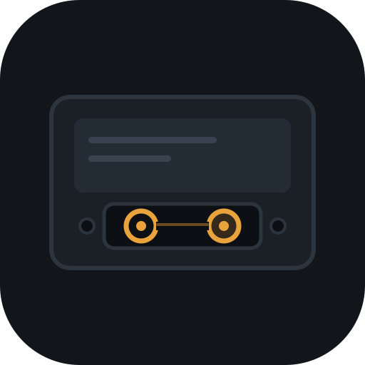

<div align="center">
  
  <h1>Cassette</h1>
  <p>A local media library and player for Windows.<br>
  Your own files, browsed like a streaming app, played like VLC.</p>
</div>

---

Cassette points at a folder on your disk, works out what is in it, and gives you
somewhere pleasant to watch it from. Nothing is uploaded, there is no account,
and it keeps working with no network at all.

## What it does

**Finds your files.** Point it at a folder and it sorts what it finds into
series, seasons and films. It reads the season and episode out of the filename
rather than trusting folder names, so release folders like
`Show Season 3 Complete 1080p WEB-DL` do not confuse it. Multi-episode files
(`S03E23E24`) are handled, and it tells you plainly what you actually own —
"54 episodes across seasons 3 to 5" — rather than pretending a series is
complete.

**Plays anything.** Playback is [mpv](https://mpv.io), embedded in the window,
so MKV, HEVC, 10-bit and surround audio work with no transcoding, and embedded
subtitles render properly.

**Remembers where you were.** Watch positions are keyed by file size and name
rather than path, so moving or renaming a folder does not lose your place.
Coming back to a series months later drops you back at the exact second.

**Subtitles, on by themselves.** Cassette turns on a subtitle track in your
preferred language when a file has one, preferring full dialogue over
signs-only and forced tracks. It picks up subtitle files sitting next to the
video too, and can search for them per episode, per season or for a whole
series. Size, colour, outline, background and position are all adjustable.

**Controls that stay out of the way.** VLC's key bindings by default, all
rebindable, and the same for mouse buttons — anything bindable to a key is
bindable to a side button. One optional binding works while the app is not
focused: it pauses and hides, and brings you back where you were.

**For watching late.** A sleep timer pauses after a set time or at the end of
the current episode. Night mode evens out quiet dialogue and loud scenes.

## Screenshots

Thumbnails are frames pulled from your own files, so a card is never blank and
no artwork is downloaded to get started.

## Running it

Requires [Node.js](https://nodejs.org) 20 or newer and Windows.

```bash
git clone https://github.com/KaisCommitted/cassette.git
cd cassette
npm install
```

Cassette bundles mpv rather than depending on an installed copy. The binary is
not in the repository because of its size, so fetch it once:

1. Download a Windows x86_64 build from
   [shinchiro/mpv-winbuild-cmake](https://github.com/shinchiro/mpv-winbuild-cmake/releases)
   (the `mpv-x86_64-*.7z` archive, not `mpv-dev`).
2. Extract `mpv.exe` to `resources/mpv/mpv.exe`.

Then:

```bash
npm run dev        # run it
npm test           # unit tests
npm run typecheck  # type check
npm run package    # build a Windows installer
```

## Where it keeps things

Everything lives in `%APPDATA%/Cassette`:

| File | What it holds |
| --- | --- |
| `library.json` | scan results — safe to delete, it rebuilds |
| `progress.json` | watch positions |
| `keybinds.json` | your bindings |
| `settings.json` | folders and preferences |
| `cache/thumbs/` | generated stills |

Writes are atomic, so a crash cannot leave a half-written file behind.

## Built with

Electron, React and TypeScript, with mpv driven over its JSON IPC socket.

## Licence

MIT — see [LICENSE](LICENSE).
